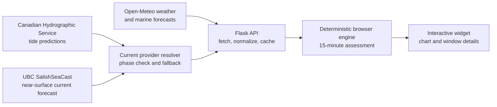

# Dive Conditions Widget

[](https://github.com/balinaanna/dive-conditions-assistant/actions/workflows/ci.yml)
[](LICENSE)

A deterministic decision-support widget that combines tide, current, weather,
and daylight forecasts to help freedivers compare conditions throughout the
day.

[**View the live demo**](https://dive-conditions-assistant.onrender.com)

The current version is configured for **Whytecliff Park, BC, Canada** and
provides guidance for today and the following two days.


## What it does

- Turns multiple marine and weather forecasts into one interactive daily view.
- Assesses the day in 15-minute intervals and groups matching results into
  selectable time windows.
- Distinguishes **Ideal**, **Good**, **Use caution**, and
  **Not recommended** conditions.
- Prioritizes local modelled current speed and direction-aware estimated
  reversals, with an additional benefit for a reversal near high tide.
- Treats wind as a secondary factor, precipitation as a smaller factor, and
  darkness as not recommended.
- Shows the full current-speed and wind ranges plus accumulated precipitation
  for the selected window.
- Loads three forecast dates progressively and caches previously requested
  data in the browser.
- Keeps a stable, responsive widget layout while data from separate endpoints
  arrives.

## Assessment model

The deployed application does **not** call an LLM. Its ratings are generated by
a deterministic rules engine: the same normalized forecast data always
produces the same scores, time windows, reasons, and recommendations.

1. The selected day is sampled every 15 minutes.
2. Tide, current, wind, precipitation, and daylight values are aligned to each
   sample.
3. Current speed establishes the base score.
4. Slack timing, high- versus low-tide context, wind, precipitation, and
   daylight adjust the result.
5. Adjacent samples with the same rating are merged into clickable windows.

See [ASSESSMENT_METHOD.md](ASSESSMENT_METHOD.md) for the scoring thresholds,
factor weights, data limitations, and selected-window calculations.

## Architecture



The Flask backend isolates external data providers and returns normalized JSON.
The browser owns the assessment rules, view state, rendering, date-level cache,
and Chart.js visualizations. This keeps the decision logic testable and makes
the eventual website embed independent of an AI service.

## Engineering highlights

- Modular vanilla JavaScript with separate assessment, data, formatting,
  rendering, view, metric, and controller modules.
- Automated tests covering backend endpoints, validation, upstream failures,
  scoring, window generation, charts, formatting, caching, and UI composition.
- Request sequencing prevents stale responses from replacing a newer date.
- Shared in-flight requests avoid duplicate API calls.
- Bounded server-side TTL caching reduces duplicate forecast-provider traffic.
- Request IDs and structured completion logs expose latency, status, and cache
  outcomes without logging forecast payloads.
- Content, permissions, referrer, and MIME-sniffing security policies preserve
  intentional iframe embedding while reducing common browser risks.
- Pinned Bootstrap and Chart.js assets are served locally, removing a
  third-party browser runtime dependency while retaining upstream MIT notices.
- Progressive loading lets independent temperature and conditions data render
  as soon as each endpoint responds.
- Gunicorn production configuration plus liveness and readiness endpoints.
- GitHub Actions CI and weekly Dependabot monitoring.

## Data sources

- **Open-Meteo weather forecast:** wind, precipitation, air temperature,
  sunrise, and sunset.
- **Open-Meteo marine forecast:** sea-surface temperature.
- **Canadian Hydrographic Service:** Point Atkinson tide predictions.
- **Canadian Hydrographic Service:** First Narrows current events for tidal
  phase comparison only; they are not used as a custom-location forecast.
- **UBC SalishSeaCast:** hourly eastward and northward current components
  averaged over the upper five model levels, nominally five metres.

The current forecast resolves the nearest wet SalishSeaCast cell around a
configured grid seed rather than assuming that the seed is water. Vector
components are interpolated before speed is calculated, and modelled reversal
times are compared with CHS slack events as a diagnostic. The provider order
is SalishSeaCast, a reserved CIOPS adapter, then an explicit unavailable
result. These limitations are documented in
[ASSESSMENT_METHOD.md](ASSESSMENT_METHOD.md).

## Project structure

| Path | Responsibility |
| --- | --- |
| `app.py` | Flask routes, validation, and API responses |
| `conditions_service.py` | Forecast-session orchestration |
| `response_cache.py` | Thread-safe response caching and request coalescing |
| `weather.py`, `tides.py`, `salishsea_currents.py` | Active external data retrieval and normalization |
| `current_forecast.py` | Current-provider order, CHS phase comparison, confidence, and fallbacks |
| `chs_currents.py` | First Narrows phase events and event-curve fallback |
| `static/assessment-engine.js` | Deterministic scoring and window generation |
| `static/forecast-data.js` | API access, caching, and shared requests |
| `static/chart-renderer.js`, `static/chart-plugins.js` | Tide and forecast charts |
| `static/views.js`, `static/widget-controller.js` | UI composition and state |
| `static/vendor/` | Pinned browser libraries and their license notices |
| `tests/` | Node test suite for browser-side modules |

## Local development

Create a virtual environment, install the dependencies, and start Flask:

```bash
python3 -m venv .venv
source .venv/bin/activate
python -m pip install -r requirements.txt
python app.py
```

Open `http://127.0.0.1:5001`.

Debug mode is disabled by default. Enable it locally when needed:

```bash
FLASK_DEBUG=true python app.py
```

## Tests

Run the complete JavaScript test suite:

```bash
node --test tests/*.test.mjs
```

Run the Python endpoint tests:

```bash
python -m unittest discover -s tests -p "test_*.py"
```

Check the Python modules and installed dependencies:

```bash
python -m compileall -q app.py chs_currents.py salishsea_currents.py conditions_service.py \
  config.py gunicorn.conf.py tides.py weather.py
python -m pip check
```

The same checks run automatically in
[GitHub Actions](https://github.com/balinaanna/dive-conditions-assistant/actions).

## Production

Run the application with Gunicorn:

```bash
gunicorn -c gunicorn.conf.py app:app
```

The server reads `PORT` from the environment and defaults to port `8000`.
Worker, thread, and timeout settings can be adjusted with
`WEB_CONCURRENCY`, `WEB_THREADS`, and `WEB_TIMEOUT`.

Deployment platforms can monitor:

- `/health` for liveness.
- `/ready` for readiness.

The public demo is hosted on Render's free tier at
[dive-conditions-assistant.onrender.com](https://dive-conditions-assistant.onrender.com).
The service can spin down while inactive, so its first response after a quiet
period may take approximately 50 seconds.

See [DEPLOYMENT.md](DEPLOYMENT.md) for the provider-neutral production
checklist, external API requirements, Wix iframe guidance, smoke tests,
monitoring, and rollback procedure.

## AI-assisted development

This project was developed with AI-assisted engineering tools, including
OpenAI Codex and Claude Code. AI supported code generation, debugging,
refactoring, test development, and API integration. The deployed application
uses deterministic in-app logic and does not use an LLM at runtime.

## Safety

This widget provides forecast guidance only. Always verify conditions on site
and use your own judgment before entering the water.

## License

This project is available under the [MIT License](LICENSE).
